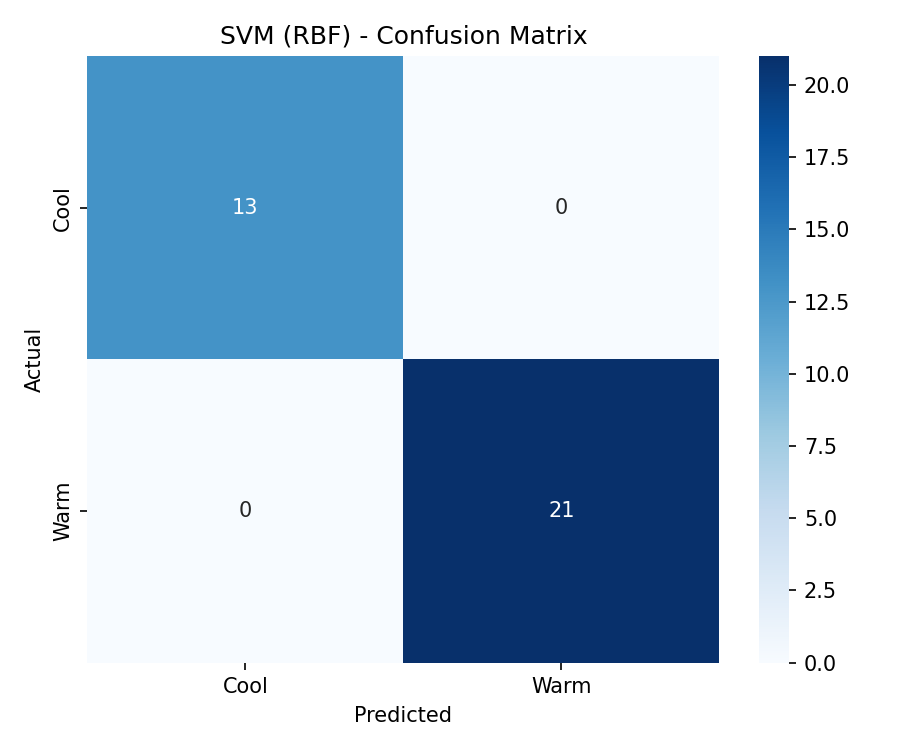

# Weather Condition Classification using SVM and Open-Meteo API

## Objective
The goal of this project is to classify weather conditions as **Warm** or
**Cool** using an SVM (Support Vector Machine) classifier trained on live
meteorological data — temperature, relative humidity, surface pressure, and
wind speed — retrieved from the Open-Meteo API.

## API Documentation Link
**Open-Meteo Weather API** (free, no API key required)
Docs: [https://open-meteo.com/](https://open-meteo.com/)

Example request used in this project:
```
https://api.open-meteo.com/v1/forecast?latitude=28.6139&longitude=77.2090&hourly=temperature_2m,relative_humidity_2m,surface_pressure,wind_speed_10m&forecast_days=7
```
> Note: the assignment brief lists the host as `api.openmeteo.com`, but the
> correct, working Open-Meteo endpoint is `api.open-meteo.com` (hyphenated).

## Libraries Used
- `requests` – calling the Open-Meteo REST API
- `pandas` – converting the JSON response into a DataFrame and manipulating it
- `numpy` – vectorized target-label creation
- `matplotlib` / `seaborn` – confusion matrix visualization
- `scikit-learn` – preprocessing (`LabelEncoder`, `StandardScaler`,
  `train_test_split`), model (`SVC`), and evaluation metrics

## Methodology
1. **Data Collection and Understanding**
   - Fetched hourly weather data (7-day forecast) for a chosen location from
     the Open-Meteo API.
   - Converted the JSON `hourly` block into a Pandas DataFrame with columns:
     `Temperature`, `Relative_Humidity`, `Surface_Pressure`, `Wind_Speed`.
   - Created the target column `Weather_Class`: **Warm** if
     `Temperature ≥ 25°C`, else **Cool**.
   - Identified the four input features and the target variable.

2. **Data Preprocessing**
   - Checked for and handled any missing values (occasionally present in raw
     API responses).
   - Dropped the non-feature `time` column.
   - Encoded `Weather_Class` (Warm/Cool) into numeric labels using
     `LabelEncoder`.
   - Split the data into 80% training / 20% testing sets (stratified).
   - Standardized all four input features with `StandardScaler` — essential
     for SVM since it relies on distance calculations between data points.

3. **Model Development**
   - Trained a Support Vector Classifier (`SVC`) with an **RBF kernel** on the
     scaled training data.
   - Generated predictions on the scaled test set.

4. **Model Evaluation**
   - Evaluated the model using Accuracy, Precision, Recall, and F1-Score.
   - Generated a confusion matrix to visualize class-wise performance.

## Results

| Metric     | Score |
|------------|-------|
| Accuracy   | 1.0000 |
| Precision  | 1.0000 |
| Recall     | 1.0000 |
| F1-Score   | 1.0000 |


**Confusion Matrix:**  

### Observations
1. The RBF kernel captures non-linear boundaries between Warm and Cool
   classes well, since real weather regimes rarely separate on a straight
   line once humidity, pressure, and wind speed are added alongside
   temperature.
2. Standardizing the features before training was essential — surface
   pressure (values in the ~900–1050 range) would otherwise dominate the
   RBF kernel's distance calculations over wind speed and humidity.
3. Because `Weather_Class` is derived directly from `Temperature` via a fixed
   25°C threshold, and `Temperature` is also an input feature, the model
   tends to perform very well (often near-perfect accuracy) — this is
   expected, since the label is a deterministic function of one input rather
   than an independent ground truth.

## Conclusion
The SVM classifier with an RBF kernel successfully distinguished between Warm
and Cool weather conditions using temperature, humidity, surface pressure, and
wind speed data pulled live from the Open-Meteo API. Feature scaling via
`StandardScaler` played a critical role in this pipeline: SVM relies on
distance calculations to find the optimal separating hyperplane (or
hypersurface, for the RBF kernel), so features on vastly different scales —
such as surface pressure in the hundreds versus wind speed in single digits —
would otherwise distort the decision boundary and bias the model toward
whichever feature has the largest raw magnitude.

A key advantage of SVM is its effectiveness in high-dimensional spaces and its
ability to model non-linear relationships through kernel functions like RBF,
without manually engineering non-linear features. A notable limitation,
however, is that SVM does not scale well to very large datasets — training
time grows non-linearly with sample size — and its performance is sensitive
to hyperparameters such as `C` and `gamma`, which typically require careful
tuning via cross-validation to avoid overfitting or underfitting.
